link:https://www.acceliance.fr/en/offers/governance-for-your-data-platform/[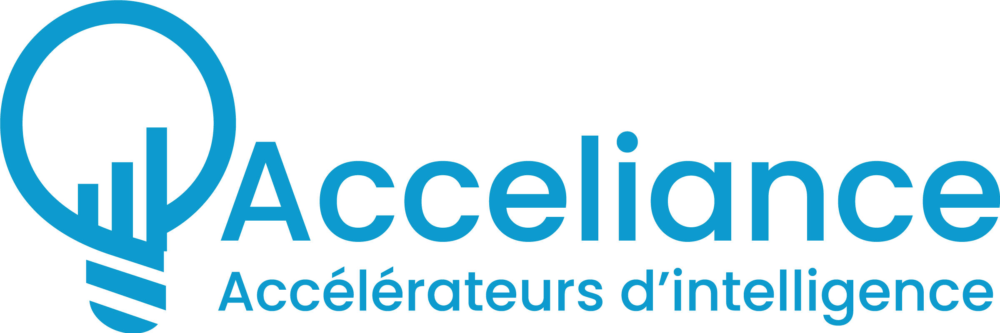]

= Generative AI For Data Modeling with Continuity and Auditability

image:https://img.shields.io/badge/Modelio-5.4.1-blue[Modelio 5.4.1,link=https://github.com/ModelioOpenSource/Modelio/releases/tag/v5.4.1,window=_blank]
image:https://img.shields.io/badge/Java-11-007396?logo=openjdk&logoColor=white[Java 11]
image:https://img.shields.io/badge/OpenAI-GPT--4.1%20%7C%20GPT--4o-412991[OpenAI,link=https://openai.com/,window=_blank]
image:https://img.shields.io/badge/Anthropic-Claude-D97757?logo=anthropic&logoColor=white[Claude,link=https://claude.ai/,window=_blank]

image:https://img.shields.io/badge/AI%20Continuity-incremental%20versioning-success[AI Continuity]
image:https://img.shields.io/badge/Auditability-full%20audit%20log-success[Auditability]
image:https://img.shields.io/badge/licence-demo%20licence%20(free)-green[Demo licence, free]
image:https://img.shields.io/badge/vendor-Acceliance-orange[Acceliance,link=https://www.acceliance.fr,window=_blank]
image:https://img.shields.io/github/last-commit/acceliance/AIForDataModeling[Last commit,link=https://github.com/acceliance/AIForDataModeling/commits/main,window=_blank]

Accceliance is pleased to provide you with a **Data Model Generator based on Generative Artificial Intelligence** as a demonstration of AI power

= How does it work ?

You provide natural language Data Model specification
a link:https://github.com/acceliance/AIForDataModeling/blob/main/data%20model%20spec.txt[sample file,window=_blank] is provided as a demo

NOTE: The specification must be accurate so to limit the interpretation by the IA Agent

IMPORTANT: The Agent is preset to to be **Experimented Data Architect** skilled so you dont need to handle this in the prompt

Then the IA Agent is set to communicate proper structured information back to Modelio modeler

= The underlying Technology
The stack is based on link:https://github.com/ModelioOpenSource/Modelio[Modelio modeler,window=_blank] with link:https://openai.com/[OpenAI,window=_blank] and link:https://claude.ai/[Claude,window=_blank]

Acceliance provides Datawarehouse Governance innovating tool on its link:https://github.com/acceliance[Github repo,window=_blank]

= Running the Live Demo

== The environment is based on Modelio, so download it at first

link:https://github.com/ModelioOpenSource/Modelio/releases/tag/v5.4.1[*Modelio 5.4.1 Download*,window=_blank]

== Opening the provided and empty Modelio project

Switch to the Modelio workspace:

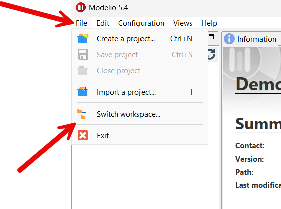

Then select the local folder created after cloning the Github repo:

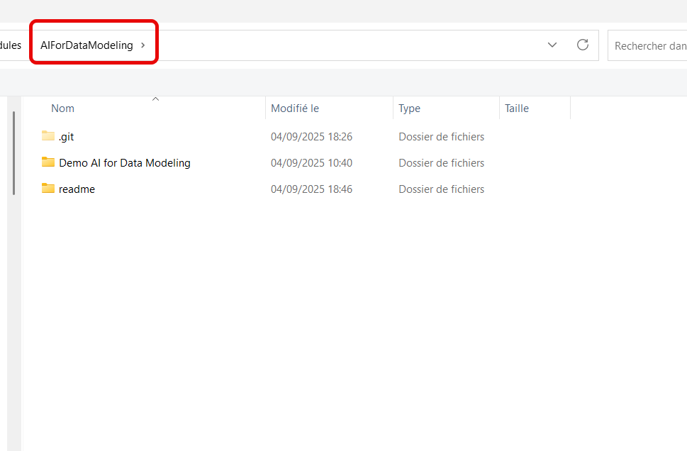

== Entering your OpenAI API Key

Open the Modules menu:

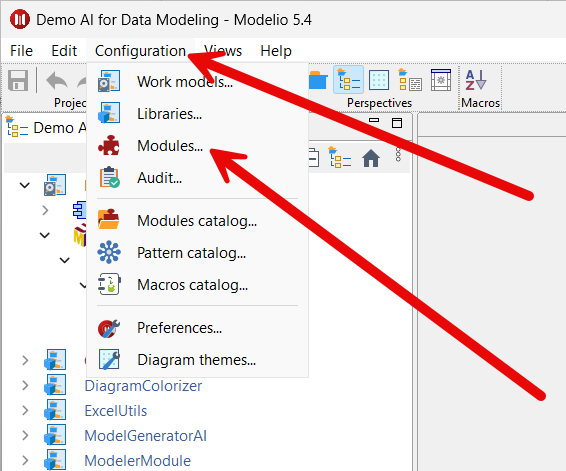

Then reach the **Model Generator AI** Modelio module (provided for the community by @Accceliance) and enter your own OpenAI API Key:

NOTE: You may also select the OpenAI Model

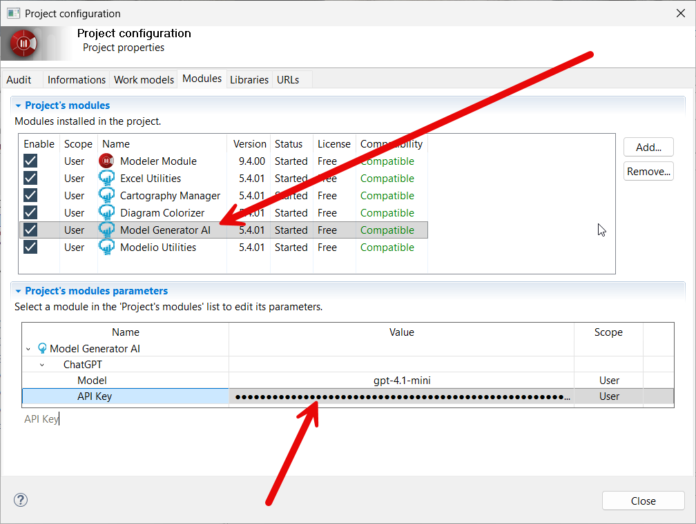

== Launching the Data Model generation

First choose the landing node in the model database:

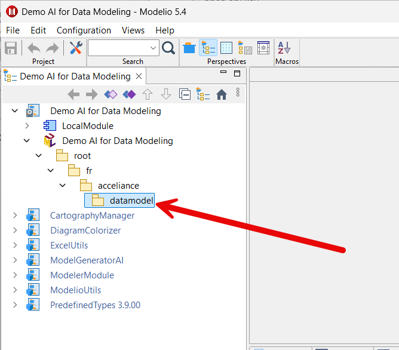

Open the IA Data Model generation Dialog:

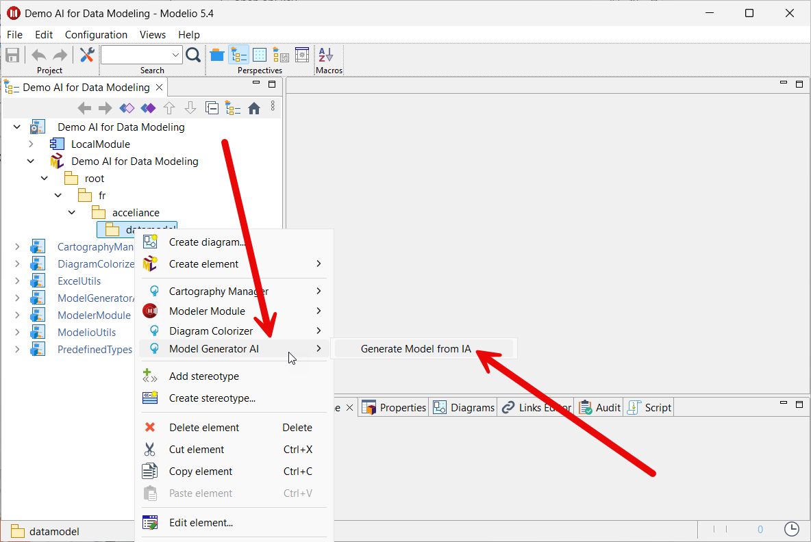

Type the Data Model specification into the field, you may copy it from the link:https://github.com/acceliance/AIForDataModeling/blob/main/data%20model%20spec.txt[aforementioned file,window=_blank]

Than launch generation using the proper button:

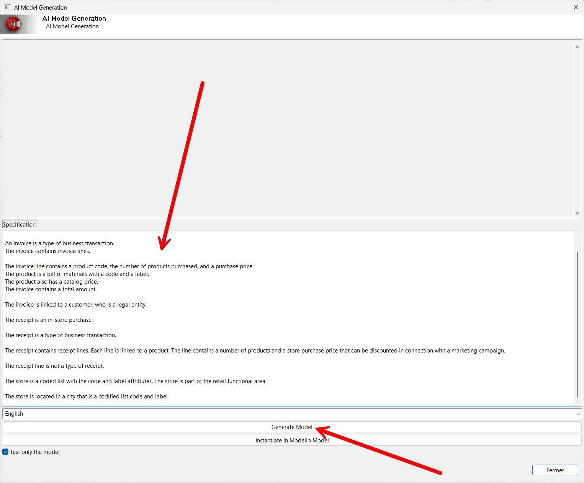

== Checking and Deploying the generated Data Model

Once the AI responds, you get a textual dump of the generated Model that is visible in the dialog box:

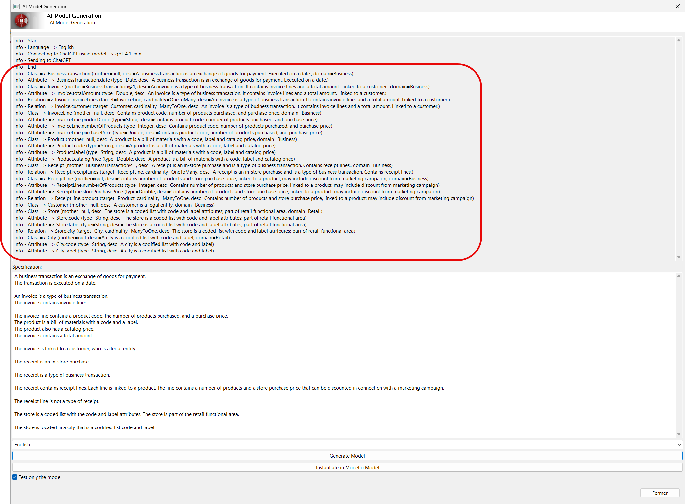

You will find all the concepts described as input, here as Classes, Attributes & Relations with Cardinalities

NOTE: You may notice documentation was allo generated, more on this later

.Textual Dump
****
Info - Class => BusinessTransaction (mother=null, desc=A business transaction is an exchange of goods for payment. Executed on a date., domain=Business)

Info - Attribute => BusinessTransaction.date (type=Date, desc=A business transaction is an exchange of goods for payment. Executed on a date.)

Info - Class => Invoice (mother=BusinessTransaction@1, desc=An invoice is a type of business transaction. It contains invoice lines and a total amount. Linked to a customer., domain=Business)

Info - Attribute => Invoice.totalAmount (type=Double, desc=An invoice is a type of business transaction. It contains invoice lines and a total amount. Linked to a customer.)

Info - Relation => Invoice.invoiceLines (target=InvoiceLine, cardinality=OneToMany, desc=An invoice is a type of business transaction. It contains invoice lines and a total amount. Linked to a customer.)

Info - Relation => Invoice.customer (target=Customer, cardinality=ManyToOne, desc=An invoice is a type of business transaction. It contains invoice lines and a total amount. Linked to a customer.)

Info - Class => InvoiceLine (mother=null, desc=Contains product code, number of products purchased, and purchase price, domain=Business)

Info - Attribute => InvoiceLine.productCode (type=String, desc=Contains product code, number of products purchased, and purchase price)

Info - Attribute => InvoiceLine.numberOfProducts (type=Integer, desc=Contains product code, number of products purchased, and purchase price)

Info - Attribute => InvoiceLine.purchasePrice (type=Double, desc=Contains product code, number of products purchased, and purchase price)

Info - Class => Product (mother=null, desc=A product is a bill of materials with a code, label and catalog price, domain=Business)

Info - Attribute => Product.code (type=String, desc=A product is a bill of materials with a code, label and catalog price)

Info - Attribute => Product.label (type=String, desc=A product is a bill of materials with a code, label and catalog price)

Info - Attribute => Product.catalogPrice (type=Double, desc=A product is a bill of materials with a code, label and catalog price)

Info - Class => Receipt (mother=BusinessTransaction@1, desc=A receipt is an in-store purchase and is a type of business transaction. Contains receipt lines., domain=Business)

Info - Relation => Receipt.receiptLines (target=ReceiptLine, cardinality=OneToMany, desc=A receipt is an in-store purchase and is a type of business transaction. Contains receipt lines.)

Info - Class => ReceiptLine (mother=null, desc=Contains number of products and store purchase price, linked to a product; may include discount from marketing campaign, domain=Business)

Info - Attribute => ReceiptLine.numberOfProducts (type=Integer, desc=Contains number of products and store purchase price, linked to a product; may include discount from marketing campaign)

Info - Attribute => ReceiptLine.storePurchasePrice (type=Double, desc=Contains number of products and store purchase price, linked to a product; may include discount from marketing campaign)

Info - Relation => ReceiptLine.product (target=Product, cardinality=ManyToOne, desc=Contains number of products and store purchase price, linked to a product; may include discount from marketing campaign)

Info - Class => Customer (mother=null, desc=A customer is a legal entity, domain=Business)

Info - Class => Store (mother=null, desc=The store is a coded list with code and label attributes; part of retail functional area, domain=Retail)

Info - Attribute => Store.code (type=String, desc=The store is a coded list with code and label attributes; part of retail functional area)

Info - Attribute => Store.label (type=String, desc=The store is a coded list with code and label attributes; part of retail functional area)

Info - Relation => Store.city (target=City, cardinality=ManyToOne, desc=The store is a coded list with code and label attributes; part of retail functional area)

Info - Class => City (mother=null, desc=A city is a codified list with code and label, domain=Retail)

Info - Attribute => City.code (type=String, desc=A city is a codified list with code and label)

Info - Attribute => City.label (type=String, desc=A city is a codified list with code and label)
****

== Checking the generated Model into Modelio

The generated Model may be faulty if AI somehow hallucinated, wich may happen or if the input text is somewhat incoherent

TIP: First check the Model before deploying using the check box in the dialog box

Use the button to instanciate and check the erros in the log, here **no errors have been found**

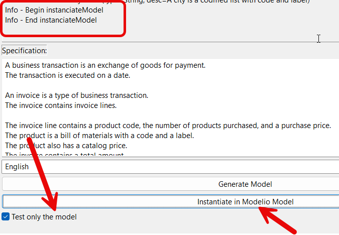

== Instanciating the generated Model into Modelio

Then uncheck the check box and again press the button to instanciate the Model

All the Model artefacts have now been mounted in the Modelio database:

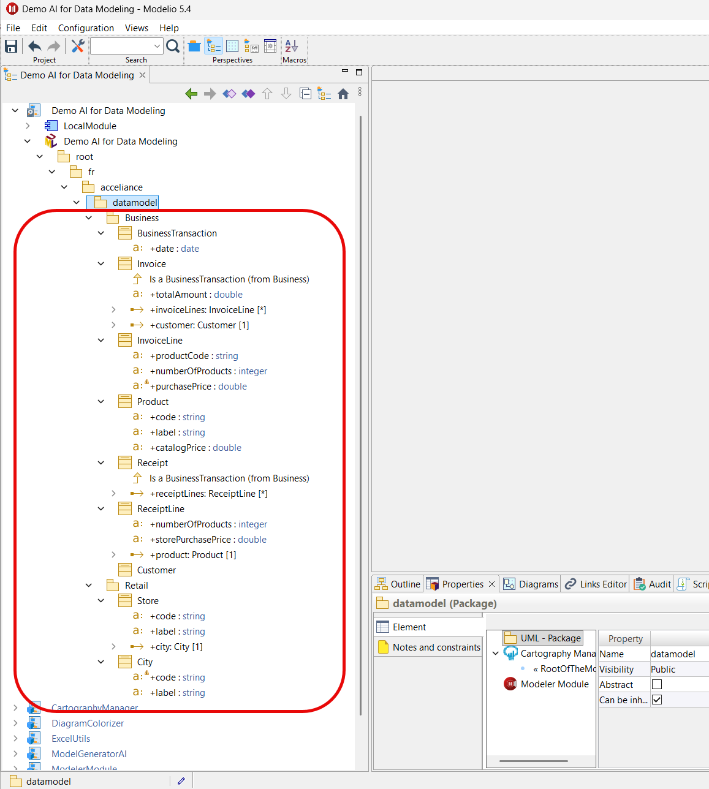

== Diagramming the Model with Modelio

Modelio includes (as all the modelers do) a diagramming facility

TIP: Use drag and drop to bring the artefacts (left panel) to the surface of the diagram (righ panel)

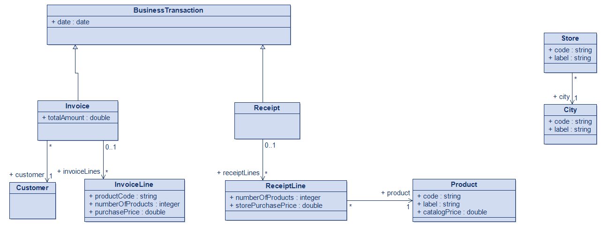

WARNING: You may find functional inconsistencies in the Model, this is absolutly normal, **the description is not accurate enough**

== Outputting the Documentation as Excel file

The documentation is an important part of Data Modeling as it contributes to:

* Setting Enterprise vocabulary
* May be reused to feed Enterprise Data Catalog

TIP: Modelio can be used to output dump into format such as CSV to be imported into Data Catalog tool such as Data Galaxy

Run the following steps:

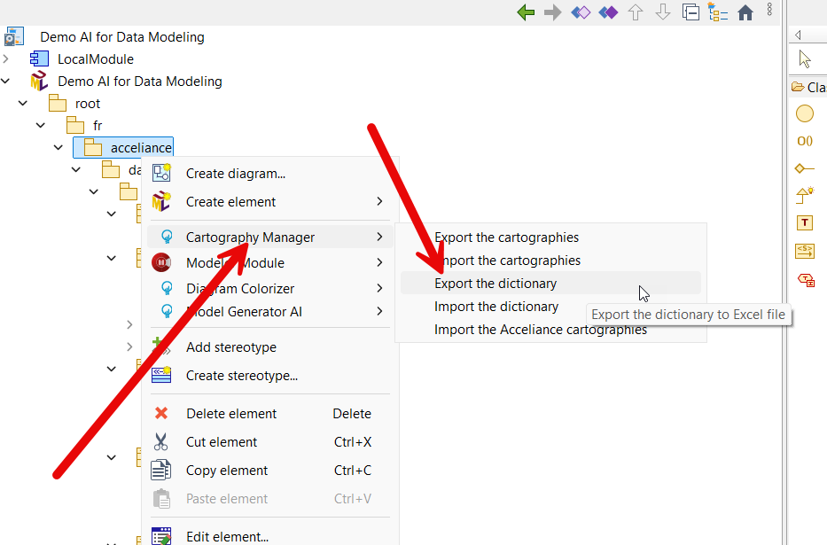

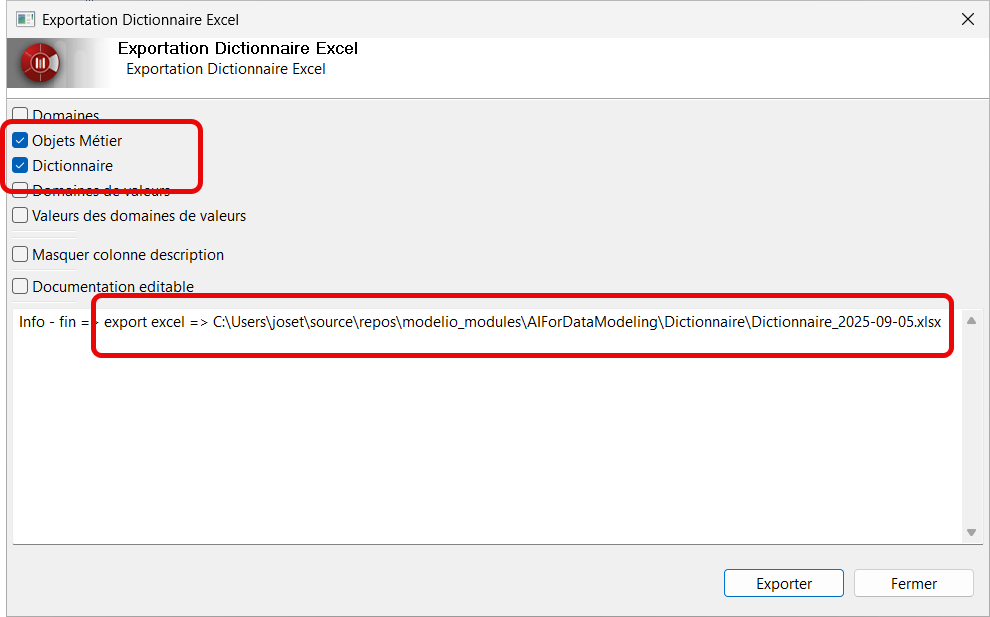

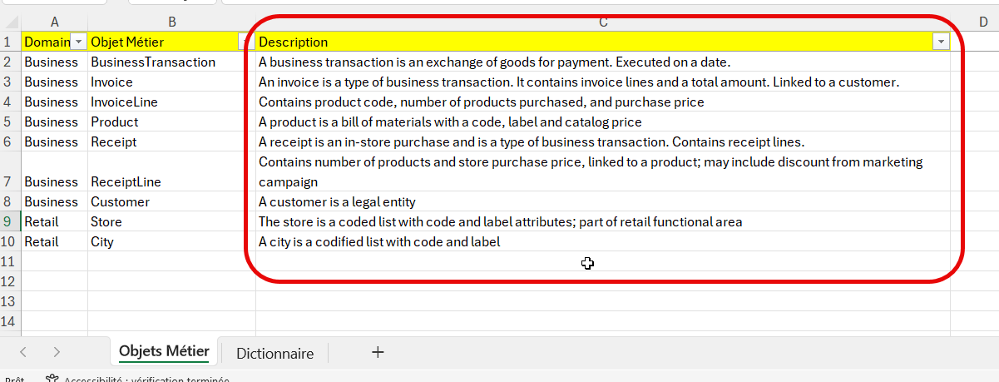

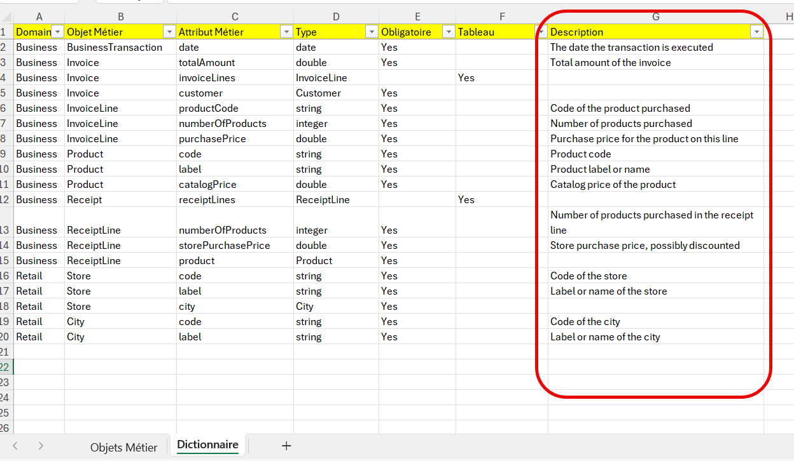

= GenAI Continuity and Versioning

Going to production with AI generated result requires **solid versioning** management.

AI is not naturally versioning compliant, why ? Because if you send AI the same request several times you get potentially different answers.

So this prevents implementing versioning.

This is where **AI Continuity** will help. How does it work ?

It works by sending **context** to AI and then extracting **only the differences** to be reinjected in the product. These differences wil be the basis for versioning.

So it is possible to use AI in an **iterative and incremental process** of building a product and smoothly deploying in producion.

With this feature it is possible to use our generator in an Agile project development, either transactional application or Data Warehouse.

== Live demo-in AI Continuity

To illustrate AI Continuity, a link:https://github.com/acceliance/AIForDataModeling/blob/main/data%20model%20spec%20v2.txt[V2 version of the Data Model specification,window=_blank] is provided.

.The difference content is as follows

****
The receipt is produced in a store

The customer has a first name and second name
****

First **select the proper node in Modelio**, this will give **proper context to AI**.

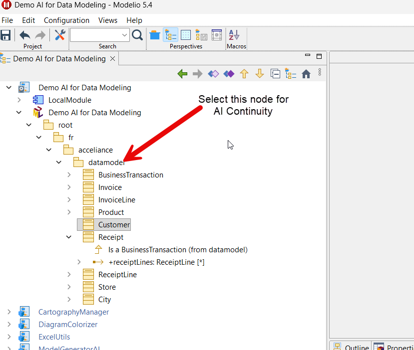

Launch AI generation using the link:https://github.com/acceliance/AIForDataModeling/blob/main/data%20model%20spec%20v2.txt[V2 version of the Data Model specification,window=_blank]

The log will show AI Continuity operations.

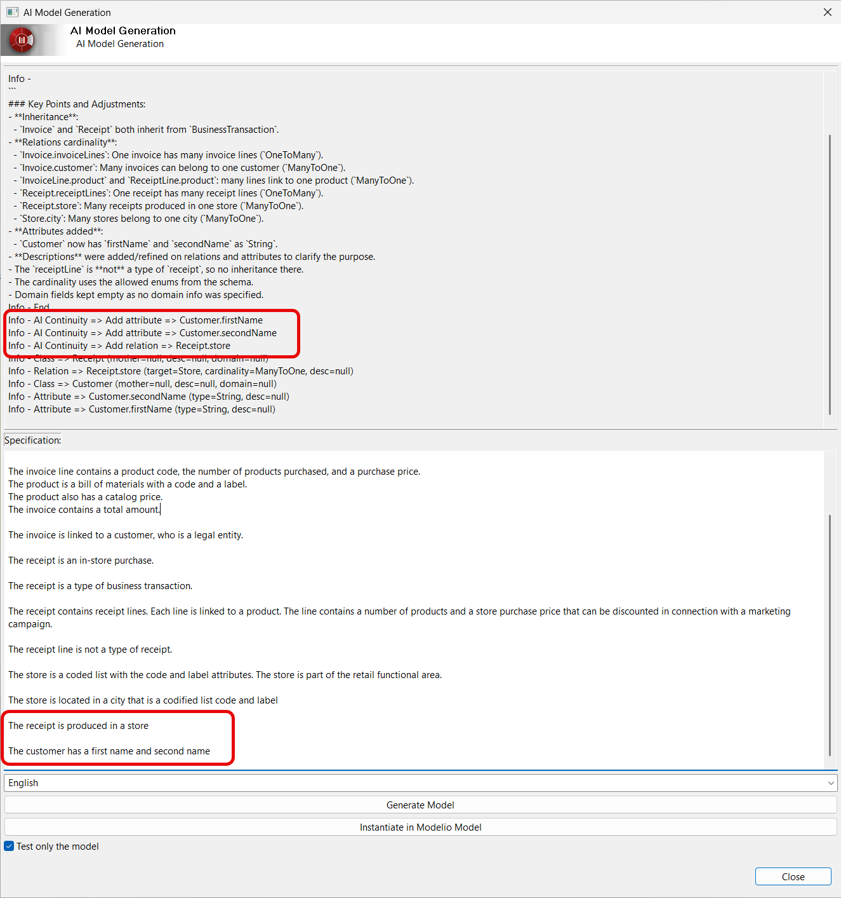

At the end, the initial Data Model has not benn modifies, **only the new elements are mounted into the Data Model**. This versioning support will allow to deploy into production in an **incremental and agile** way.

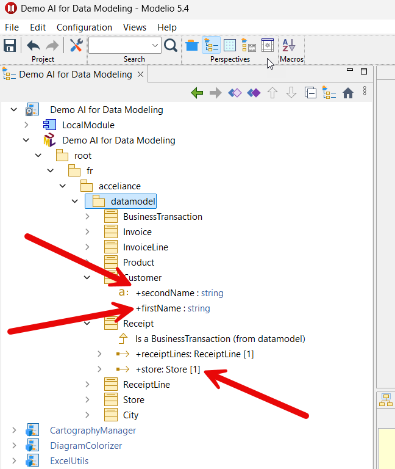

= Continuum of Architecture

Now that we have a strong versioning framework working, we will be able to generate ready-for-production Data Models using link:https://www.acceliance.fr/en/offers/functional-data-platform-governance/[Modelio,window=_blank].

== Datavault Builder

In this sample Modelio generated link:https://www.acceliance.fr/en/offers/automated-data-platform/[Datavault Builder,window=_blank] Model configuration.

The link:https://github.com/acceliance/AIForDataModeling/tree/main/DatavaultBuilder[model was generated,window=_blank] for BigQuery, Postgres, Snowflake and Synapse databases.

== DBT

In this sample Modelio generated link:https://www.getdbt.com/[DBT Model,window=_blank] Model DBT models.

The DBT models are generated link:https://github.com/acceliance/AIForDataModeling/tree/main/DbtModel/models/silver_datamodel[in the DBT project,window=_blank].

== SQL

In this sample Modelio generated SQL tables, columns and relations (please note that PK columns were added manually as the Data Model specifications dont address them).

The link:https://github.com/acceliance/AIForDataModeling/tree/main/SqlGenerated[DDL files are generated,window=_blank] for BigQuery, Postgres, Snowflake and Synapse databases.

== How to generate Models on your own Projetcs ?

The models generated before use special Acceliance modules wich are not part of this repo.

**Acceliance gives free use to those generators to its customers**

= Auditability

The platform is fully auditable wich is mandatory for solid AI implementation.

Each time deploymebnt is done, the log is added.

For link:https://github.com/acceliance/AIForDataModeling/blob/main/AIAuditLog/AIAuditTransaction_2025-09-12-17-56-03.log[V1 a first log was generated,window=_blank].

For link:https://github.com/acceliance/AIForDataModeling/blob/main/AIAuditLog/AIAuditTransaction_2025-09-12-17-57-51.log[V2 a second log was generated,window=_blank].

= Investigation on Usages

We are investigating on true life usages. For example, we are investigating generating Data Model specification from a link:https://support.microsoft.com/en-us/office/use-copilot-in-microsoft-teams-meetings-0bf9dd3c-96f7-44e2-8bb8-790bedf066b1[Teams Meeting unsing Copilot,window=_blank] when workshoping with the Business representative in an Data project.

Please do not hesitate to share with us your true life use cases :-)

== Contribute to help us improve the Model Generator

Please do not hesitate to report any malfunctioning as well as missing feature.

= Conclusion : The 3 pillars of Artificial Intelligence 

This module for Data Modeling generation is strongly implementes using the **mandatory** 3 pillars of good AI implementation:

* High quality prompting for high quality results

* Continuity for incremental build

* Auditability to fully trace all the modifications made by the AI process

= Terms of Use

The generator is free of use with a link:https://github.com/acceliance/AIForDataModeling/blob/main/Demo%20AI%20for%20Data%20Modeling/acceliance_modelgeneratorai.lic[demo licence,window=_blank]. The only thing we ask from you is to request for a dedicated licence for production use.

Acceliance being a Data&AI consultancy company, this will help us develop our network of leads.

